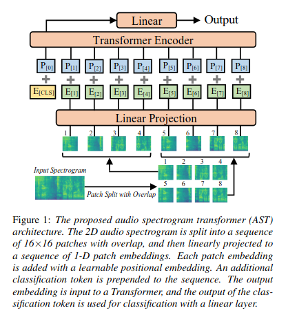

# AST: Audio Spectrogram Transformer

**Paper:** https://arxiv.org/pdf/2104.01778  
**Code:** [https://github.com/YuanGongND/ast](https://github.com/YuanGongND/ast)  
**Year:** 2021

## Summary

This paper challenges the dominance of Convolutional Neural Networks (CNNs) in audio classification by introducing the **Audio Spectrogram Transformer (AST)**, the first purely attention-based, convolution-free model for this task. For years, audio classification models have relied on CNNs to process spectrograms, often adding an attention mechanism on top to capture global context. This work questions whether the CNN backbone is necessary at all.

The authors propose a model that directly applies a Transformer architecture to an audio spectrogram. The core idea is to treat the spectrogram like an image, splitting it into a sequence of patches and feeding them into a Transformer encoder. A key innovation is a method for **transferring knowledge from Vision Transformer (ViT) models pre-trained on the large-scale ImageNet dataset**. This cross-modality pre-training is crucial, as it allows the AST to achieve high performance even on smaller audio datasets, which typically lack the millions of samples needed to train a Transformer from scratch. The AST sets a new state-of-the-art on multiple major audio classification benchmarks, demonstrating that a pure Transformer can outperform established CNN-attention hybrid models.

### Architecture

The AST architecture is intentionally simple and directly adapts the Vision Transformer (ViT) for the audio domain. It processes a spectrogram without relying on traditional convolutional layers for feature extraction.

The model's pipeline consists of the following steps:
*   **Input Spectrogram**: The input audio waveform is first converted into a 2D log Mel spectrogram.
*   **Patching**: This spectrogram is divided into a sequence of 16x16 pixel patches, with some overlap between them to ensure context is maintained.
*   **Linear Projection**: Each 2D patch is flattened and linearly projected into a 1D vector (embedding), creating a sequence of "patch embeddings." This projection is handled by what the paper calls a patch embedding layer.
*   **Positional Embedding**: Since the Transformer itself does not inherently understand the order of the patches, a learnable positional embedding is added to each patch embedding. This allows the model to learn the 2D spatial structure of the original spectrogram.
*   **Transformer Encoder**: A special `[CLS]` token is prepended to the sequence, which is then fed into a standard Transformer encoder (12 layers, 12 heads). The self-attention mechanism within the encoder allows the model to weigh the importance of all patches relative to each other, capturing long-range dependencies across the entire spectrogram from the very first layer.
*   **Classification**: The final output embedding corresponding to the `[CLS]` token is used as the representation for the entire audio clip. This representation is passed to a final linear layer to produce the classification labels.

## Datasets Used

The AST was evaluated across a variety of audio classification tasks to demonstrate its versatility and performance.

| Dataset Name | Task(s) | Data Size | Other Details |
| :--- | :--- | :--- | :--- |
| **AudioSet** | Weakly-labeled audio event classification | Over 2 million 10-second clips | The primary benchmark used for evaluation, containing 527 sound classes. |
| **ESC-50** | Environmental sound classification | 2,000 5-second clips | A standard benchmark for general sound classification across 50 categories. |
| **Speech Commands V2** | Speech command recognition | ~105,000 1-second clips | Used to test performance on a common speech-related task with 35 distinct commands. |
| **ImageNet** | Vision Model Pre-training | Over 14 million images | Not an audio dataset, but the source of the pre-trained weights for the Vision Transformer adapted by AST. |

## Experiments and Results

AST was shown to outperform previous state-of-the-art models on all evaluated benchmarks, often by a significant margin. The primary evaluation metric for AudioSet was mean Average Precision (mAP), while accuracy was used for ESC-50 and Speech Commands.

The table below compares the performance of a single AST model against the previous state-of-the-art (SOTA) CNN-attention model, PSLA.

| Model | Architecture | AudioSet (mAP) | ESC-50 (Accuracy) | Speech Commands V2 (Accuracy) |
| :--- | :--- | :--- | :--- | :--- |
| PSLA / Previous SOTA | CNN + Attention | 0.444 | 94.7% | 97.7% |
| **AST (Single Model)** | **Pure Attention** | **0.459** | **95.6%** | **98.1%** |

Key findings from the experiments include:
*   On the full **AudioSet**, an ensemble of AST models achieved a new SOTA mAP of **0.485**.
*   The model proved highly effective even on smaller datasets. On ESC-50, AST achieved **88.7%** accuracy even without pre-training on any audio data (only ImageNet), outperforming previous models trained from scratch.
*   Ablation studies confirmed that **ImageNet pre-training is essential** for the model's success. An AST trained from scratch performed significantly worse than one initialized with pre-trained ViT weights.
*   The proposed method for adapting the positional embeddings from the 2D image domain to the 1D (variable-length) audio domain was also shown to be a critical factor in the model's performance.

## Key Innovations

The success of the Audio Spectrogram Transformer is built on two primary innovations: a novel architecture for the task and a highly effective training strategy.

*   **Convolution-Free Audio Classification**: AST is the first model to demonstrate that a pure Transformer, without any CNN layers, can be a top-performing architecture for audio classification. This simplifies the model design and shows that the inductive biases of CNNs (like local connectivity) are not a prerequisite for success in the audio domain.
*   **Cross-Modality Transfer Learning from Images**: The paper introduces a practical method for adapting an off-the-shelf Vision Transformer (ViT) pre-trained on ImageNet to the audio domain. Since spectrograms can be treated as single-channel images, this allows the model to leverage the powerful representations learned from a massive vision dataset. This approach overcomes the major limitation of Transformers—their need for vast amounts of training data—making them viable for audio tasks where data is often less plentiful.

## Implications and Future Work

This research marks a significant shift in audio classification, proving that CNNs are not indispensable. The AST provides a simpler, yet more powerful, alternative to complex CNN-attention hybrid models. Because the fixed AST architecture achieves state-of-the-art results on diverse audio tasks (from environmental sounds to speech) with varying input lengths, it has strong potential to serve as a **generic, all-purpose audio classifier**.

This work opens the door for further exploration of pure Transformer models in other audio and time-series analysis tasks. Future research could focus on developing more efficient versions of the AST or exploring different methods for adapting pre-trained models from other modalities.
