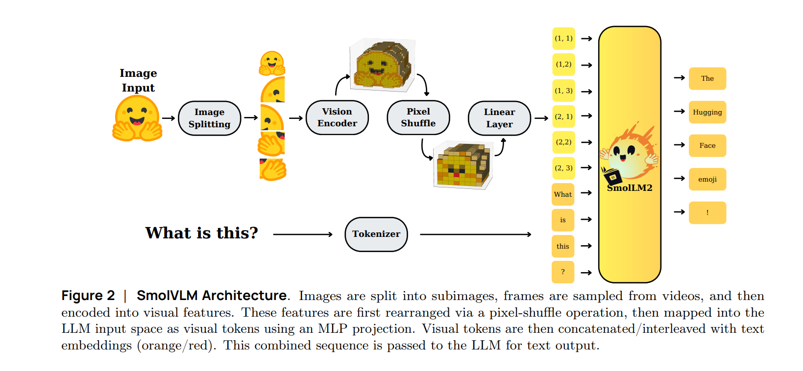

Of course. Here is the summary for "SmolVLM: Redefining small and efficient multimodal models". The text below is already free of bracketed citations.

# SmolVLM: Redefining small and efficient multimodal models

**Paper:** https://arxiv.org/abs/2504.05299  
**Code:** https://github.com/huggingface/smollm     
**Blog:** https://huggingface.co/blog/smolvlm2      
**Year:** 2025  

## Summary

This paper addresses the significant challenge of the high computational cost and large memory footprint of state-of-the-art large vision-language models (LVLMs). Current models, while powerful, are often too resource-intensive for deployment on consumer-grade hardware, edge devices, or in browser-based applications, limiting their accessibility and practical use.

To tackle this, the authors introduce **SmolVLM**, a family of compact and efficient multimodal models designed to deliver strong performance with a fraction of the computational resources. The core idea is to re-evaluate architectural choices and training strategies for smaller models. Instead of simply scaling down larger architectures, SmolVLM employs aggressive visual token compression through a **pixel shuffle** strategy and uses a highly optimized, custom-trained small language model (SmolLM2) as its backbone. This method is distinct because it prioritizes memory efficiency and inference speed from the ground up, proving that smaller, strategically designed models can outperform competitors that are orders of magnitude larger.

### Architecture

The proposed method is built upon the Idefics3 architecture but incorporates several key modifications to optimize for size and efficiency. It uses a **SmolLM2 1.7B** model as its language backbone, which was specifically fine-tuned to handle a long context window of 16k tokens. For vision, it uses a shape-optimized SigLIP model. The most significant innovation is its aggressive visual compression, which reduces the visual information from image patches by a factor of nine, drastically lowering the number of tokens the language model needs to process. This architectural design allows the models to handle multiple high-resolution images and even video frames while maintaining a very small memory footprint.

## Datasets Used

SmolVLM was trained using the same open-source datasets as the Idefics3 model, primarily **The Cauldron** and **Docmatix**. For evaluation, the model was tested against a wide range of established benchmarks to measure its capabilities in general understanding, reasoning, and document analysis.

| Benchmark/Task | Purpose |
| :--- | :--- |
| MMMU | General multimodal understanding (college-level problems) |
| MMStar | Advanced multimodal understanding and reasoning |
| MathVista | Mathematical reasoning with visual context |
| DocVQA | Document Visual Question Answering |
| TextVQA | Text-based Visual Question Answering |
| AI2D | Diagram understanding and reasoning |
| CinePile | Video analysis and understanding |

## Experiments and Results

The authors evaluate the SmolVLM family (256M, 500M, and 2.2B parameters) against other open-source models. The results demonstrate that SmolVLM achieves competitive or superior performance while requiring significantly less GPU memory. The flagship **SmolVLM-2.2B** model, for instance, requires only 4.9 GB of VRAM, compared to over 10 GB for similarly sized competitors.

Some key results for the primary instruction-tuned model are summarized below:

| Model | MMMU (val) | MathVista (testmini) | DocVQA (test) | Min GPU RAM (GB) |
| :--- | :--- | :--- | :--- | :--- |
| **SmolVLM (1.7B)** | 38.8 | 44.6 | 81.6 | **5.02** |
| Qwen2-VL (2B) | 41.1 | 47.8 | 90.1 | 13.70 |
| InternVL2 (2B) | 34.3 | 46.3 | 86.9 | 10.52 |
| PaliGemma (3B) | 34.9 | 28.7 | 32.2 | 6.72 |
| moondream2 | 32.4 | 24.3 | 70.5 | 3.87 |

Another important finding was the model's high throughput. Compared to Qwen2-VL, SmolVLM's prefill throughput is up to **4.5 times faster**, and its generation throughput is up to **16 times faster**. This efficiency makes it highly suitable for interactive, real-time applications.

## Model Components

The **SmolVLM** architecture consists of an efficient vision encoder, an aggressive compression module, and a long-context language model.

*   **Vision Encoder (SigLIP)**: This component processes input images by dividing them into patches of 384x384 pixels. It is optimized to handle various image shapes and resolutions efficiently.
*   **Pixel Shuffle Compression**: This is a key innovation where the visual features extracted by the encoder are spatially rearranged into channels. This technique reduces the number of visual tokens by 9x, drastically compressing the visual information before it is sent to the language model.
*   **Language Model (SmolLM2)**: The model uses a 1.7B parameter language model as its core. Its context window was extended from its original size to 16,000 tokens, allowing it to process long sequences of interleaved text and images, including multiple images or sequences of video frames.
*   **MLP Projector**: A simple multi-layer perceptron maps the compressed visual tokens into the language model's input space, allowing the LLM to process them alongside text embeddings.

The diagram below illustrates how these components work together. Images are encoded and then heavily compressed. The resulting lightweight visual tokens are combined with text prompts and fed into the long-context language model, which generates the final textual response.

*   **Input**: Interleaved Image(s) and Text.
*   **Processing**:
    *   The **Vision Encoder** converts images into feature patches.
    *   **Pixel Shuffle** drastically reduces the number of tokens representing the visual data.
    *   The **MLP Projector** aligns visual tokens with the text embedding space.
    *   The **SmolLM2** language model processes the combined multimodal sequence to understand the context and generate a response.
*   **Output**: Textual response.

## Implications and Future Work

The implications of this research are significant for making advanced AI more accessible. By creating powerful vision-language models that can run on consumer-grade GPUs, laptops, and even in a web browser, SmolVLM lowers the barrier to entry for developers and researchers. This work paves the way for a new class of applications in customized local AI, privacy-preserving tools, and on-device assistants.

The paper's conclusion emphasizes the power of thoughtful architectural design over sheer scale. By open-sourcing the models, datasets, and training recipes, the authors aim to empower the community to build upon this work. Future efforts will likely focus on further optimizing the trade-offs between model size and capability, as well as fine-tuning SmolVLM for specialized, real-world tasks.

