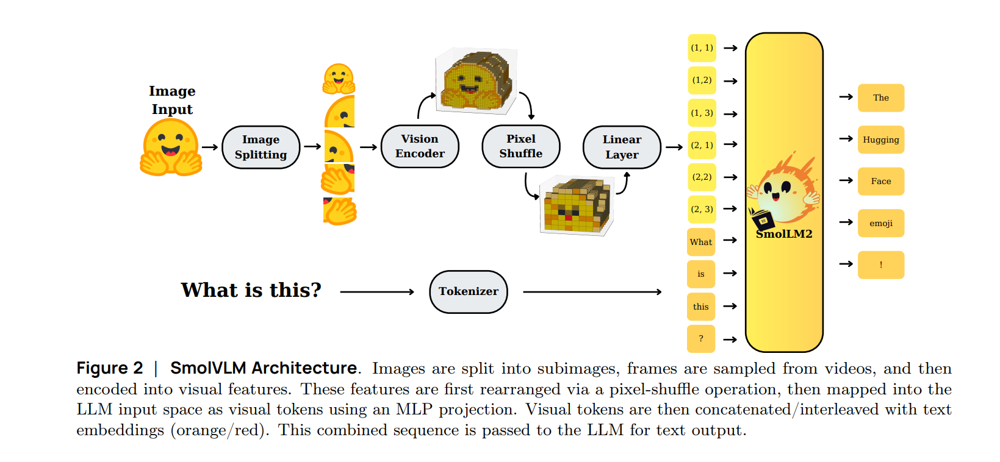

# nanoVLM: The Simplest Repository to Train Your VLM in Pure PyTorch

**Paper:** https://huggingface.co/blog/nanovlm
**Code:** https://github.com/huggingface/nanoVLM
**Year:** 2025

## Summary

This blog post addresses the challenge that training Vision Language Models (VLMs) can be complex and overwhelming, especially for beginners. Inspired by Andrej Karpathy's nanoGPT, the authors introduce **nanoVLM**, a lightweight and intentionally simple toolkit designed to make VLM training accessible to a wider audience. The project's main goal is to provide a minimal and readable pure PyTorch repository that allows users to train their own VLM, even on a free-tier Colab notebook.

To tackle this, the authors created a toolkit that simplifies the entire process, focusing on the specific task of Visual Question Answering (VQA). The core idea is to offer a transparent and easy-to-understand codebase that demystifies how VLMs work. This approach is distinct from larger, more complex frameworks by prioritizing educational value and ease of use over achieving state-of-the-art performance.

### Architecture

The proposed method uses a standard VLM architecture built from well-known components. The vision backbone is Google's **SigLIP** vision encoder, and the language backbone is based on the **Llama 3** architecture, specifically using a small, custom-trained model called `SmolLM2-135M`.

The key innovation for efficiency is in how the vision and text data are combined. A **Modality Projection** module aligns the image and text embeddings. This module uses a **pixel shuffle** operation to aggressively compress the visual tokens, reducing their number. This significantly lowers the computational cost and speeds up training, as the language model is sensitive to the length of the input sequence.

## Datasets Used

The nanoVLM model provided in the repository was trained on a subset of The Cauldron dataset. The training script is designed to load data using the Hugging Face `load_dataset` API and is evaluated against the MMStar dataset during training.

| Dataset Name | Task(s) | Data Size (Samples) | Other Details |
| :--- | :--- | :--- | :--- |
| The Cauldron | Visual Question Answering | ~1.7 Million | Used for the main training of the published model. |
| MMStar | VQA / Evaluation | Not specified | Used as a test set for evaluation during the training loop. |

## Experiments and Results

The authors emphasize that the goal of nanoVLM is not to compete with state-of-the-art models but to serve as a transparent and educational tool. The provided model was trained for approximately 6 hours on a single H100 GPU. The results demonstrate its ability to perform basic visual question answering.

Some qualitative results from the trained model are shown below:

| Image | Prompt | Generation |
| :--- | :--- | :--- |
| Two cats on a bed | What is this? | In the picture I can see the pink color bed sheet. I can see two cats lying on the bed sheet. |
| A woman doing yoga | What is the woman doing? | Here in the middle she is performing yoga |

The training script also logs performance metrics like token throughput (tokens/sec) to Weights & Biases for monitoring.

## Model Components

The **nanoVLM** architecture consists of a vision backbone, a language backbone, and a modality projector to connect them.

*   **Vision Backbone**: Uses a pre-trained `google/siglip-base-patch16-224` model. This is a standard Vision Transformer (ViT) that processes the input image and extracts visual embeddings.
*   **Language Backbone**: Uses a pre-trained `HuggingFaceTB/SmolLM2-135M` model. This Llama 3-style model functions as the language decoder, generating text based on the combined visual and textual input.
*   **Modality Projector**: This is a crucial component for efficiency. It takes the image embeddings from the vision backbone and transforms them into embeddings that are compatible with the language model. It consists of:
    *   A **pixel shuffle** operation, which reduces the number of image tokens to lower computational load.
    *   A linear layer to project the transformed embeddings into the correct dimension.

The diagram below illustrates how these components work together. An image is processed by the SigLIP vision encoder. The resulting embeddings are passed through the Modality Projector, which compresses them. These compressed visual embeddings are then concatenated with the tokenized text prompt and fed into the SmolLM2 language model to generate a final text answer.

*   **Input**: Image + Text Prompt
*   **Processing**:
    1.  The **Vision Backbone** (SigLIP) creates image embeddings.
    2.  The **Modality Projector** compresses these embeddings using pixel shuffle.
    3.  The compressed image embeddings are combined with the text prompt's embeddings.
    4.  The **Language Backbone** (SmolLM2) processes the combined sequence and generates text.
*   **Output**: Textual Response (Answer to the visual question).

## Implications and Future Work

The implications of nanoVLM are primarily educational. By providing a simple, readable, and functional VLM training repository, this work significantly lowers the barrier to entry for developers, students, and researchers interested in multimodal AI. It serves as a practical learning tool and a solid foundation for building more complex or specialized models.

The project is presented as a starting point. The authors encourage the community to use the toolkit, build upon it for their own datasets and use cases, and contribute to the project. The focus is on fostering understanding and enabling more people to experiment with and innovate in the VLM space.

