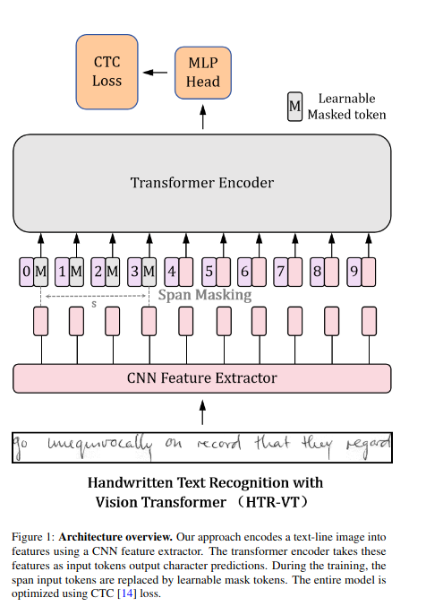

# HTR-VT: Handwritten Text Recognition with Vision Transformer

**Paper:** [https://arxiv.org/pdf/2409.08573](https://arxiv.org/pdf/2409.08573)  
**Code:** [Publicly available (as stated in the paper)  ](https://github.com/YutingLi0606/HTR-VT)
**Year:** 2024

## Summary

This paper addresses the challenge of applying Vision Transformer (ViT) models to **Handwritten Text Recognition (HTR)**, a field where the limited availability of labeled data has traditionally favored Convolutional Neural Network (CNN) based approaches. Standard ViT models typically require extensive pre-training on large datasets to perform well, making them difficult to adapt to the smaller, more specialized datasets common in HTR.

To overcome this limitation, the authors introduce **HTR-VT**, a data-efficient ViT-based method that achieves competitive results without needing large-scale pre-training or external data. The core innovation is a hybrid architecture that replaces the standard ViT patch embedding with a more effective CNN-based feature extractor. This is combined with advanced optimization and regularization techniques, including the **Sharpness-Aware Minimization (SAM) optimizer** and a novel **span mask** technique, which allows the model to train effectively on smaller datasets. The result is a model that not only competes with established CNN-based methods but also sets a new state-of-the-art benchmark on the large LAM dataset.

### Architecture

The proposed HTR-VT model integrates the strengths of both CNNs and Transformers in a streamlined, encoder-only architecture. This design is specifically tailored for data-efficient learning in HTR tasks.

The model is composed of three main components:
*   **CNN Feature Extractor**: Instead of the standard ViT approach of dividing the input image into patches, HTR-VT uses a CNN to process the image and extract a rich feature map. This leverages the proven ability of CNNs to capture local spatial hierarchies effectively.
*   **Vision Transformer (ViT) Encoder**: The feature map from the CNN is then fed into a standard ViT encoder. The encoder's self-attention mechanism models the long-range dependencies between different parts of the feature map, which is crucial for recognizing cursive and connected handwriting styles.
*   **CTC Head**: A linear layer followed by a Connectionist Temporal Classification (CTC) loss function is used for the final text prediction. The CTC loss allows the model to learn alignments between the visual features and the character sequence without requiring precise per-character annotations.

## Datasets Used

The model was evaluated on three standard HTR benchmark datasets of varying sizes to demonstrate its effectiveness and scalability.

| Dataset Name | Description | Data Size (Train) | Data Size (Test) |
| :--- | :--- | :--- | :--- |
| **IAM** | A widely used benchmark of English handwritten sentences from multiple writers. | 6,161 lines | 2,781 lines |
| **READ2016** | A dataset of early modern manuscripts from the 16th to 18th centuries, presenting challenges in style and degradation. | 7,618 lines | 2,374 lines |
| **LAM** | The largest publicly available HTR dataset, consisting of historical Arabic manuscripts. | 19,830 lines | 2,130 lines |

## Experiments and Results

The authors conducted extensive experiments to evaluate HTR-VT against both traditional CNN-based models and other Transformer-based HTR systems. The primary metrics used were **Character Error Rate (CER)** and **Word Error Rate (WER)**, where lower values indicate better performance. The results show that HTR-VT is highly competitive, particularly on the larger and more challenging LAM dataset.

Key results on the benchmark datasets are highlighted below.

| Dataset | Model | CER (%) | WER (%) |
| :--- | :--- | :--- | :--- |
| **IAM** | DAN (CNN-based) | 3.19% | 11.9% |
| | **HTR-VT (Ours)** | **3.02%** | **11.1%** |
| **READ2016** | DAN (CNN-based) | 4.39% | 15.3% |
| | **HTR-VT (Ours)** | **4.21%** | **14.8%** |
| **LAM** | CRNN-F (CNN-based) | 1.83% | 5.34% |
| | **HTR-VT (Ours)** | **1.52%** | **4.61%** |

An important finding from ablation studies was the significant contribution of the **SAM optimizer** and the **span mask** technique. Using SAM led to a notable improvement in performance by helping the model find flatter, more generalizable minima. The span mask, which acts as a regularizer by masking connected regions of the feature map, was also shown to be crucial for preventing overfitting, especially on the smaller datasets.

## Key Innovations

The success of **HTR-VT** is driven by several key methodological innovations designed to make ViT models more data-efficient.

-   **CNN-based Feature Extraction**: The most critical modification is the replacement of the standard patch embedding in ViT with a **CNN backbone**. This allows the model to learn powerful, locally-aware features from the input image before the Transformer encoder processes them, making the learning process more stable and efficient.
-   **Sharpness-Aware Minimization (SAM)**: The use of the SAM optimizer is a key element for improving generalization. By seeking out flatter loss landscapes, SAM ensures that the model is less sensitive to small perturbations in the training data, which is particularly beneficial when working with limited datasets.
-   **Span Mask Regularization**: The authors introduce a novel regularization technique called **span mask**. Instead of masking random individual patches (like in standard masked image modeling), this method masks out contiguous blocks or "spans" in the feature map generated by the CNN. This forces the model to learn more robust and context-aware representations, acting as an effective regularizer.

## Implications and Future Work

This research demonstrates that Vision Transformers can be highly effective for handwritten text recognition, even without relying on massive datasets for pre-training. By thoughtfully combining CNNs and Transformers and employing modern optimization and regularization techniques, HTR-VT provides a powerful and data-efficient solution for HTR tasks. This work establishes a new benchmark for performance on the large-scale LAM dataset and offers a strong foundation for future research in the field.

The authors suggest that future work could explore the application of these techniques to other document analysis tasks where labeled data is scarce. There is also potential to investigate more sophisticated CNN architectures for feature extraction or to adapt the model for multilingual HTR by incorporating larger character sets.

## BibTeX Citation

```bibtex
@misc{li2024htrvt,
      title={HTR-VT: Handwritten Text Recognition with Vision Transformer}, 
      author={Yuting Li and Dexiong Chen and Tinglong Tang and Xi Shen},
      year={2024},
      eprint={2409.08573},
      archivePrefix={arXiv},
      primaryClass={cs.CV}
}
```
