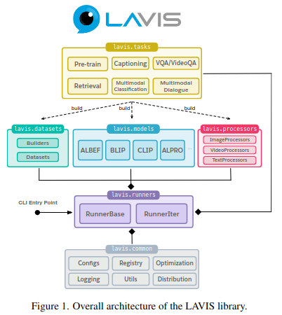

# LAVIS: A Library for Language-Vision Intelligence

**Paper:** https://arxiv.org/pdf/2209.09019  
**Code:** [https://github.com/salesforce/LAVIS](https://github.com/salesforce/LAVIS)  
**Year:** 2022

## Summary

This paper introduces **LAVIS (LAnguage-VISion)**, a comprehensive, open-source deep learning library designed to unify and accelerate research in the language-vision domain. The primary challenge it addresses is the fragmentation and complexity of working with state-of-the-art multimodal models. Researchers and practitioners often face inconsistent interfaces, non-trivial data preparation, and a lack of standardized benchmarks, which hinders progress and adoption.

LAVIS aims to be a **one-stop, modular library** that solves these problems. It provides a unified framework for training, evaluating, and benchmarking a wide array of language-vision models across numerous tasks and datasets. Key features include easy access to pre-trained models, automated dataset downloading, and a highly extensible design that simplifies the development of new models and applications. By centralizing these resources, LAVIS significantly reduces the effort required to conduct reproducible research and leverage advanced multimodal AI.

### Key Contributions

The LAVIS library is built around a modular and unified design to streamline research and development in language-vision AI.



Its main contributions are:
*   **Unified Framework**: Provides a single, consistent interface for accessing over 30 pre-trained and fine-tuned checkpoints from foundational models like ALBEF, BLIP, CLIP, and ALPRO.
*   **Comprehensive Task Support**: Supports a diverse range of tasks, including image/video retrieval, visual question answering (VQA), image captioning, multimodal classification, and visual dialogue.
*   **Extensive Dataset Integration**: Integrates over 20 popular public datasets, such as COCO, Flickr30k, VQAv2, MSRVTT, and ImageNet, with tools for automatic downloading and setup.
*   **Reproducibility and Benchmarking**: Ensures that its model implementations faithfully replicate the performance of the original papers and provides a standardized benchmark for fair comparison.
*   **Extensibility**: The modular design allows users to easily integrate new models, datasets, and tasks, facilitating future research and custom applications.

## Supported Models

LAVIS includes implementations of several state-of-the-art foundation models for both image-text and video-text tasks.

| Model | Modality | Key Features |
| :--- | :--- | :--- |
| **ALBEF** | Image-Text | Uses a vision transformer (ViT) and a BERT-based multimodal encoder. Employs a novel image-text contrastive loss and momentum distillation to align unimodal features before fusion. |
| **BLIP** | Image-Text & Video-Text | Features a versatile Mixture of Encoder-Decoder (MED) architecture that can perform both understanding and generation tasks. Known for its high-quality text generation and effective dataset bootstrapping technique. |
| **CLIP** | Image-Text | Consists of two separate unimodal encoders (one for images, one for text) trained on 400 million image-text pairs. It excels at producing robust and generalizable zero-shot representations. |
| **ALPRO** | Video-Text | A specialized video-text model that uses a TimeSformer for video and BERT for text. It aligns features using contrastive loss and is highly effective for video retrieval and question answering tasks. |

## Supported Tasks and Datasets

The library offers extensive support for a wide variety of standard language-vision tasks and the datasets used to evaluate them.

| Task Category | Supported Tasks | Key Datasets |
| :--- | :--- | :--- |
| **Image-Text** | Retrieval, Visual Question Answering (VQA), Image Captioning, Visual Entailment, Visual Dialogue, NLVR, Image Classification | COCO, Flickr30k, VQAv2, OK-VQA, A-OK-VQA, NoCaps, SNLI-VE, VisDial, ImageNet |
| **Video-Text** | Retrieval, Video Question Answering (VideoQA), Video Dialogue | MSRVTT, MSVD, DiDeMo, AVSD |
| **Pre-training** | Image-Text Pre-training | COCO, Visual Genome, SBU Captions, Conceptual Captions, LAION |

## Experiments and Results

The authors validate the library by benchmarking their re-implementations against the officially reported results of the original models. The experiments, conducted on NVIDIA A100 GPUs, confirm that the models in LAVIS consistently achieve performance on par with the official versions across all major tasks, including retrieval, VQA, and classification.

For example, the replicated **BLIP** model achieves a CIDEr score of 133.5 on COCO captioning, nearly identical to the official 133.3. Similarly, the **ALBEF** model scores 76.35 on the VQAv2 test-dev set, closely matching the official 75.84.

Furthermore, the paper demonstrates the library's utility by adapting existing models to new tasks. By fine-tuning ALBEF and BLIP on knowledge-based VQA datasets (OK-VQA and A-OK-VQA), they surpass previous state-of-the-art results, showcasing the library's flexibility and power for novel research.

## Library Design and Toolkit

LAVIS is engineered for ease of use and extensibility. It features a modular architecture with distinct components for runners, tasks, datasets, models, and processors. This separation allows for easy customization and off-the-shelf use of individual parts, such as using a model for feature extraction with just a few lines of code.

The library also includes a rich toolkit to lower the barrier to entry for researchers:
*   **Model Zoo**: Access to dozens of pre-trained and fine-tuned model checkpoints that are downloaded automatically.
*   **Dataset Tools**: Scripts for automatic downloading and preparation of common datasets, along with a GUI-based dataset browser to help users inspect the data.
*   **Web Demo**: An interactive GUI demo that showcases various multimodal capabilities like VQA, image captioning, and multimodal search.

## BibTeX Citation

```bibtex
@misc{li2022lavis,
      title={LAVIS: A Library for Language-Vision Intelligence}, 
      author={Dongxu Li and Junnan Li and Hung Le and Guangsen Wang and Silvio Savarese and Steven C.H. Hoi},
      year={2022},
      eprint={2209.09019},
      archivePrefix={arXiv},
      primaryClass={cs.CV}
}
```
