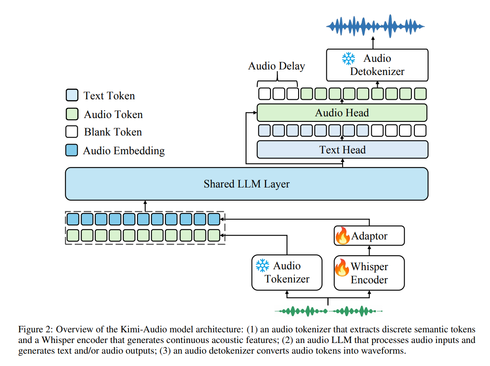

# Kimi-Audio Technical Report

**Paper:** https://arxiv.org/abs/2504.18425  
**Code:** https://github.com/MoonshotAI/Kimi-Audio      
**Year:** 2025

## Summary

This paper addresses the significant challenge of creating a unified, large-scale audio foundation model that can seamlessly perform understanding, generation, and conversational tasks. Current approaches often excel in one specific area (like speech recognition or text-to-speech) but lack the integration needed for versatile, real-world applications. This specialization limits the development of advanced conversational AI and sophisticated audio processing tools.

To tackle this, the authors introduce **Kimi-Audio**, an open-source, all-in-one audio foundation model. The core idea is to build a single system that can process and generate long-form audio with high fidelity. The method is distinct due to its massive-scale pre-training on approximately 13 million hours of diverse audio and its innovative generation technique. Kimi-Audio employs a novel **look-ahead mechanism** in its diffusion-based generator, which is a training-free method to resolve quality issues at the boundaries of audio chunks, enabling smooth, continuous audio generation.

### Architecture


The proposed method is built upon a comprehensive architecture that integrates modules for both audio understanding and generation. The model is pre-trained on a vast corpus of text-only, audio-only, and paired audio-text data. An efficient, automated data processing pipeline was developed to annotate raw audio at scale, generating high-quality, long-form data crucial for training. The generation component is a diffusion-based model that converts semantic tokens into mel-spectrograms for high-fidelity audio synthesis.

## Datasets Used

Kimi-Audio was trained on a massive pre-training corpus and fine-tuned on a variety of public and internal datasets for specific tasks. The pre-training data included approximately 13 million hours of audio from sources like audiobooks, podcasts, and interviews.

| Dataset Name | Audio Length (hours) | Task Type | SFT Epochs |
| :--- | :--- | :--- | :--- |
| WenetSpeech | 10,518 | ASR | 2.0 |
| WenetSpeech4TTS | 12,085 | ASR | 2.0 |
| AISHELL-1 | 155 | ASR | 2.0 |
| AISHELL-2 | 1,036 | ASR | 2.0 |
| AISHELL-3 | 65 | ASR | 2.0 |
| Emilla | 98,305 | ASR | 2.0 |
| Fleurs | 17 | ASR | 2.0 |
| CommonVoice | 43 | ASR | 2.0 |
| KeSpeech | 1,428 | ASR | 2.0 |
| Magicdata | 747 | ASR | 2.0 |

## Experiments and Results

The authors evaluate Kimi-Audio on a wide range of audio tasks, with a particular focus on Automatic Speech Recognition (ASR). The results show that Kimi-Audio sets a new state-of-the-art, significantly outperforming other leading open-source models.

Key ASR results are summarized below (WER indicates Word Error Rate, where lower is better):

| Datasets | Model | Performance (WER ↓) |
| :--- | :--- | :--- |
| LibriSpeech (test-clean / test-other) | Qwen2-Audio-base | 1.74 / 4.04 |
| | Baichuan-Audio-base| 3.02 / 6.04 |
| | Step-Audio-chat | 3.19 / 10.67 |
| | Qwen2.5-Omni | 2.37 / 4.21 |
| | **Kimi-Audio** | **1.28 / 2.42** |
| Fleurs (zh / en) | Qwen2-Audio-base | 3.63 / 5.20 |
| | Baichuan-Audio-base| 4.15 / 8.07 |
| | **Kimi-Audio** | **2.67 / 4.34** |
| Kimi-ASR Internal Testset (subset1 / subset2) | Step-Audio-chat | 2.82 / 4.74 |
| | Qwen2.5-Omni | 1.53 / 2.68 |
| | **Kimi-Audio** | **1.42 / 2.44** |

An important finding was Kimi-Audio's superior performance across multiple languages and challenging acoustic conditions, demonstrating the robustness of its training and architecture.

## Model Components

The **Kimi-Audio** architecture is a unified system designed for comprehensive audio processing. Its major components are:

*   **Data Processing Pipeline**: An automated system that processes vast amounts of raw audio. It handles tasks like noise reduction, speaker diarization, and transcription to generate high-quality, long-form annotated data for training.
*   **Audio Understanding Module**: A core component responsible for tasks like Automatic Speech Recognition (ASR), speaker recognition, and music understanding. It processes audio inputs and converts them into meaningful representations.
*   **Audio Generation Module**: This module uses a diffusion-based model for high-fidelity audio synthesis. It takes semantic tokens (from text or other modalities) and generates corresponding mel-spectrograms, which are then converted into waveforms.
*   **Look-Ahead Mechanism**: A key innovation for audio generation. To prevent quality degradation at the boundaries of audio chunks, this training-free mechanism uses a few semantic tokens from the *next* chunk to inform the generation of the *current* chunk. This provides future context and ensures a smooth, continuous output, which is crucial for long-form audio.

The following diagram illustrates how these components work together: Raw audio is first refined by the data pipeline for training. In deployment, user input (audio or text) is processed by the understanding module. For generation tasks, the generation module, enhanced by the look-ahead mechanism, synthesizes the final audio output.

*   **Input**: Raw Audio / Text
*   **Processing**:
    *   The **Audio Understanding Module** analyzes input for tasks like ASR or emotion recognition.
    *   The **Audio Generation Module** synthesizes audio from text prompts. The **Look-Ahead Mechanism** ensures seamless transitions between audio chunks.
*   **Output**: Transcribed Text / Synthesized Audio / Conversational Response

## Implications and Future Work

The implications of this research are substantial. By open-sourcing a powerful, all-in-one audio model, the authors democratize access to state-of-the-art audio AI. This can accelerate innovation in areas like human-computer interaction, content creation, personalized education, and assistive technologies. The ability to handle long-form, multi-speaker audio opens up new possibilities for applications like meeting summarization, podcast transcription, and real-time translation.

The paper's conclusion highlights the model's strong performance across a variety of benchmarks. Future work will likely focus on expanding the model's capabilities to more diverse audio tasks, further improving generation quality, and reducing the computational resources required for deployment.

### BibTeX Citation

```bibtex
@misc{ding2025kimiaudio,
      title={Kimi-Audio Technical Report}, 
      author={Ding Ding and Zeqian Ju and Yichong Leng and Songxiang Liu and Tiezheng Liu and Zewang Shang and Kexin Shen and Wenoy Song and Xu Tan and Haohe Liu and Di Luo and Hanggeng Li and Dongkai Wang and Simian Luo and Yukang Chen and Xinsheng Wang and Lei Wang and Yafeng Deng and Qian Yang and Yue-xin Wu and Ziyang Ma and Liu-Jiang Xu and Wei-Qiang Zhang and Tao Wang and Chao-Yang Wang and Guohong Fu and Tao Jiang and Hong-Xia Yang and De-Chuan Zhan and Chang-Zhou and Jing-Ren Zhou and KimiTeam},
      year={2025},
      eprint={2504.18425},
      archivePrefix={arXiv},
      primaryClass={eess.AS}
}
```