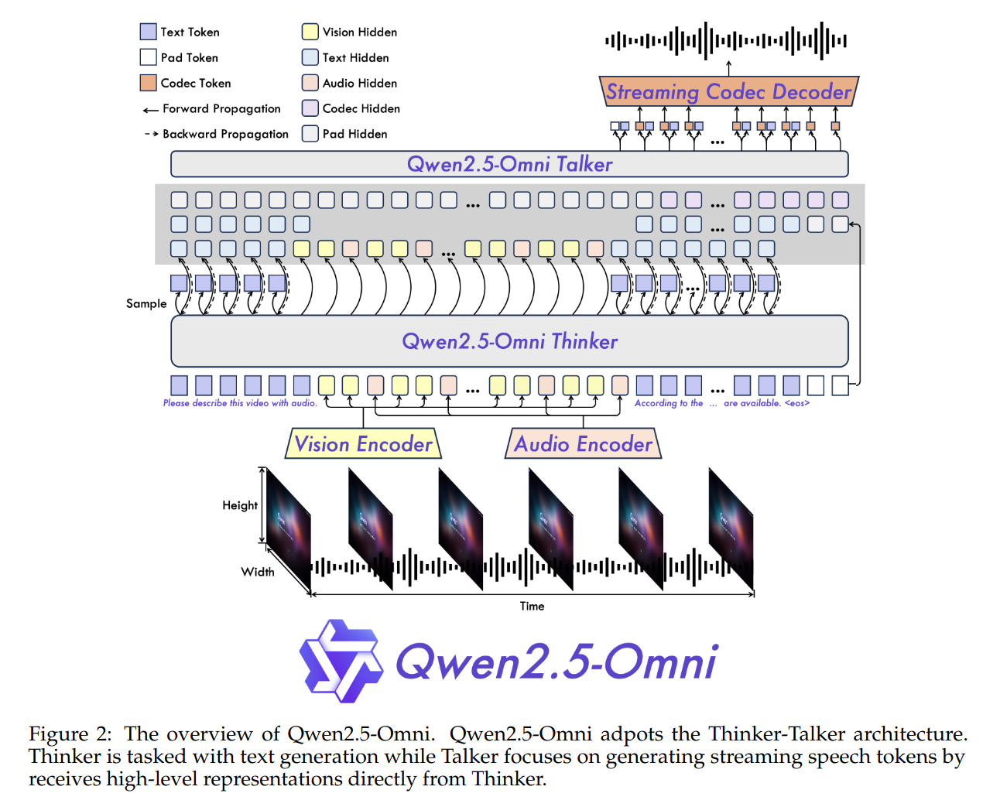

# Qwen2.5-Omni Technical Report

**Paper:** https://arxiv.org/pdf/2503.20215  
**Code:** [https://github.com/QwenLM/Qwen2.5-Omni](https://github.com/QwenLM/Qwen2.5-Omni)  
**Year:** 2025   
**Hugging Face:** [https://huggingface.co/Qwen](https://huggingface.co/Qwen)   

## Summary

This paper introduces **Qwen2.5-Omni**, a unified, end-to-end multimodal model capable of perceiving a wide range of inputs—including text, images, audio, and video—and generating responses in both text and natural-sounding speech in a streaming fashion. The model addresses several key challenges in creating a comprehensive "omni-model." These challenges include the effective joint training of diverse modalities, preventing interference between different output types (text and speech), and enabling real-time, low-latency interaction.

To solve these problems, the authors propose two core innovations. The first is a novel position embedding technique called **TMRoPE (Time-aligned Multimodal RoPE)**, which synchronizes the temporal information between audio and video streams by interleaving them. The second is the **Thinker-Talker architecture**, which separates the tasks of language reasoning and speech generation. The "Thinker" (a large language model) handles text generation, while the "Talker" (a speech model) uses the Thinker's internal states to produce audio tokens concurrently. This design, combined with streaming-optimized encoders and decoders, allows Qwen2.5-Omni to achieve state-of-the-art performance on multimodal benchmarks while maintaining strong capabilities in single-modality tasks.

### Architecture


Qwen2.5-Omni is built on the **Thinker-Talker architecture**, designed to function as a cohesive, end-to-end trainable system. The Thinker acts as the "brain," processing all input modalities, while the Talker acts as the "mouth," generating speech.

The main components include:
*   **Perception (Input Encoders)**:
    *   **Text**: Uses Qwen's byte-pair encoding tokenizer.
    *   **Audio**: Converts raw waveforms to mel-spectrograms, processed by an encoder based on Qwen2-Audio.
    *   **Vision**: Employs a Vision Transformer (ViT) from Qwen2.5-VL to handle both images and videos. To support streaming, the audio and vision encoders use block-wise attention to process long sequences in chunks.
*   **TMRoPE (Time-aligned Multimodal RoPE)**: A novel positional embedding method that deconstructs embeddings into temporal, height, and width components. For video with audio, it aligns the two streams by organizing them into interleaved 2-second chunks based on their actual timestamps.
*   **Generation (Thinker-Talker)**:
    *   **Thinker**: A Transformer decoder LLM that processes the encoded inputs and generates text autoregressively. It is initialized from Qwen2.5.
    *   **Talker**: A dual-track autoregressive model that receives high-level representations directly from the Thinker to generate speech tokens. This allows the Talker to anticipate the tone and prosody of the speech before the full text is generated, enabling more natural streaming audio without needing explicit word-level alignment.
*   **Streaming Speech Codec**: The generated audio tokens are converted into a waveform using a custom speech codec and a DiT (Diffusion Transformer) model. This decoder uses a sliding-window attention mechanism to minimize initial latency for streaming output.

## Training and Fine-Tuning

The model undergoes a multi-stage training process to develop its comprehensive abilities.

1.  **Initial Stage**: The LLM parameters are frozen, and only the vision and audio encoders are trained on large image-text and audio-text datasets to learn fundamental cross-modal alignments. The vision encoder is initialized from Qwen2.5-VL and the audio encoder from Whisper-large-v3.
2.  **Second Stage**: All model parameters are unfrozen. The model is trained on a massive, mixed-multimodal dataset including over 800 billion image/video tokens and 300 billion audio tokens to deepen the interaction between modalities.
3.  **Long-Sequence Stage**: The model is further trained on data with sequences up to 32,768 tokens to enhance its ability to understand long and complex contexts.
4.  **Post-Training**:
    *   **Thinker** is fine-tuned on instruction-following data in ChatML format across text, visual, and audio domains.
    *   **Talker** undergoes a three-stage process: in-context learning to predict speech continuation, Direct Preference Optimization (DPO) to improve stability and reduce hallucinations, and multi-speaker fine-tuning to enhance naturalness.

## Experiments and Results

Qwen2.5-Omni was evaluated on a wide range of benchmarks, demonstrating performance that is often comparable to or better than specialized single-modality models of a similar size. The model sets a new state-of-the-art on multimodal benchmarks like OmniBench.

*   **Text-Only Performance**: On tasks like MMLU and GSM8K, the 7B parameter version of Qwen2.5-Omni performs between Qwen2-7B and Qwen2.5-7B, showing that its multimodal training did not significantly compromise its language capabilities.
*   **Audio-to-Text Performance**: The model achieves state-of-the-art results in Automatic Speech Recognition (ASR), Speech-to-Text Translation (S2TT), and audio reasoning, outperforming models like Whisper-large-v3 and Qwen2-Audio on several benchmarks. Critically, its performance on complex reasoning tasks when given speech instructions is nearly as high as when given text instructions, significantly closing the gap seen in previous models.
*   **Image-to-Text Performance**: Qwen2.5-Omni's performance is comparable to the specialized Qwen2.5-VL vision model and surpasses other open-source omni-models on benchmarks for math (MathVision), general VQA (MMBench), and OCR (TextVQA).

The table below shows the model's strong performance on speech instruction following, where it dramatically narrows the performance gap compared to text-based inputs.

| Dataset | Qwen2-7B (Text Input) | Qwen2-Audio (Speech Input) | Qwen2.5-Omni-7B (Speech Input) |
| :--- | :--- | :--- | :--- |
| **MMLU*** | 69.3 | 33.2 | 65.6 |
| **GSM8K*** | 82.3 | 18.4 | 85.4 |
| **Math23K*** | 92.3 | 23.0 | 87.1 |

*\*Approximately 90% of text instructions were converted to speech for evaluation.*

## BibTeX Citation

```bibtex
@misc{qwen_team2025qwen2.5-omni,
      title={Qwen2.5-Omni Technical Report}, 
      author={Qwen Team},
      year={2025},
      eprint={2503.20215},
      archivePrefix={arXiv},
      primaryClass={cs.CL}
}
```
