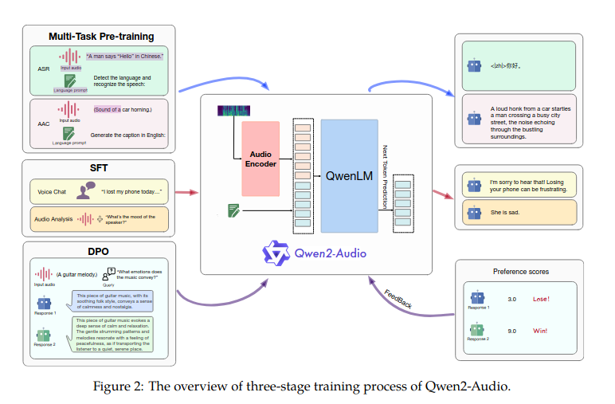

Of course. Here is the summary with the requested changes.

# Qwen2-Audio Technical Report

**Paper:** https://arxiv.org/abs/2407.10759  
**Code:** https://github.com/QwenLM/Qwen2-Audio  
**Hugging Face:** [https://huggingface.co/Qwen](https://huggingface.co/Qwen)  
**Year:** 2024

## Summary

This paper addresses the challenge of creating a large-scale audio-language model with advanced instruction-following capabilities. Existing approaches often face difficulties in understanding diverse types of audio (speech, music, environmental sounds) and interacting naturally with users. The paper highlights the need for a unified model that can seamlessly handle various audio inputs for tasks like audio analysis and conversational chat without requiring explicit user commands to switch modes.

To tackle this, the authors introduce **Qwen2-Audio**, a large audio-language model (LALM) designed to process both audio and text inputs to generate text outputs. The core idea behind this model is a simplified three-stage training process: multi-task pre-training, supervised fine-tuning (SFT), and direct preference optimization (DPO). This method is distinct from previous work because it uses natural language prompts during pre-training instead of complex hierarchical tags, which enhances generalization and instruction-following abilities. Furthermore, Qwen2-Audio is uniquely capable of understanding and responding to voice commands embedded within a larger audio stream containing other sounds or speech.

### Architecture


The proposed method is built upon a dual-component architecture comprising an audio encoder and a large language model (LLM). The audio encoder is initialized from the **Whisper-large-v3** model, while the language model component is the **Qwen-7B** model. This architecture, with a total of 8.2 billion parameters, allows the model to effectively process raw audio waveforms by converting them into mel-spectrograms and then generating coherent and context-aware textual responses. The training objective is to maximize the probability of the next text token, conditioned on the audio representation and the preceding text.

## Datasets Used

The paper evaluates Qwen2-Audio on a comprehensive set of 13 datasets covering a range of audio-related tasks. The datasets were strictly excluded from the training data to prevent leakage and ensure a fair evaluation.

| Dataset Name | Task(s) | Split | Metric |
| --- | --- | --- | --- |
| Fleurs | Automatic Speech Recognition (ASR) | dev \| test | Word Error Rate (WER) |
| Aishell2 | Automatic Speech Recognition (ASR) | test | Word Error Rate (WER) |
| Librispeech | Automatic Speech Recognition (ASR) | dev \| test | Word Error Rate (WER) |
| Common Voice | Automatic Speech Recognition (ASR) | dev \| test | Word Error Rate (WER) |
| CoVoST2 | Speech-to-Text Translation (S2TT) | test | BLEU Score |
| Meld | Speech Emotion Recognition (SER) | test | Accuracy (ACC) |
| VocalSound | Vocal Sound Classification (VSC) | test | Accuracy (ACC) |
| AIR-Bench | Instruction Following (Chat) | dev \| test | GPT-4 Evaluation |

## Experiments and Results

The authors evaluate Qwen2-Audio on ASR, S2TT, SER, VSC, and instruction-following chat benchmarks without any task-specific fine-tuning. The results demonstrate that Qwen2-Audio achieves state-of-the-art performance across multiple tasks, notably outperforming previous models like Gemini-1.5-pro on the AIR-Bench benchmark for audio-centric instruction-following.

Some key results from the paper are summarized below:

| Task | Dataset | Model | Performance (Metric) |
| :--- | :--- | :--- | :--- |
| **ASR** | Librispeech (test-clean) | Qwen-Audio | 2.0 (WER ↓) |
| | | **Qwen2-Audio** | **1.6 (WER ↓)** |
| **ASR** | Aishell2 (Android) | Qwen-Audio | 3.3 (WER ↓) |
| | | **Qwen2-Audio** | **2.9 (WER ↓)** |
| **S2TT** | CoVoST2 (en-zh) | Qwen-Audio | 41.5 (BLEU ↑) |
| | | **Qwen2-Audio** | **45.2 (BLEU ↑)** |
| **VSC** | VocalSound | Qwen-Audio | 0.9289 (ACC ↑) |
| | | **Qwen2-Audio** | **0.9392 (ACC ↑)** |
| **Chat** | AIR-Bench (Speech) | Gemini-1.5-pro | 6.97 (GPT-4 ↑) |
| | | **Qwen2-Audio** | **7.18 (GPT-4 ↑)** |
| **Chat** | AIR-Bench (Mixed-Audio) | Gemini-1.5-pro | 5.27 (GPT-4 ↑) |
| | | **Qwen2-Audio** | **6.77 (GPT-4 ↑)** |

Another important finding was that Qwen2-Audio shows significant improvements over its predecessor, Qwen-Audio, and other leading LALMs, establishing a new state-of-the-art standard in instruction-following capabilities across speech, sound, music, and mixed-audio scenarios.

## Model Components

The **Qwen2-Audio** architecture consists of an audio encoder and a large language model, trained through a three-stage process:

*   **Audio Encoder**: This component is based on the **Whisper-large-v3** model. Its function is to process raw audio input by first resampling it to 16kHz, then converting it into a 128-channel mel-spectrogram. A pooling layer is used to reduce the length of the audio representation, with each frame of the encoder's output corresponding to about 40ms of the original audio signal.
*   **Large Language Model (LLM)**: The model uses **Qwen-7B** as its foundational language model. This component receives the encoded audio representation and previous text tokens to generate the final text output by predicting the next token in the sequence.
*   **Training Process**:
    1.  **Multi-Task Pre-training**: The model is pre-trained on a large volume of data using natural language prompts for different audio tasks, which improves its generalization and instruction-following abilities.
    2.  **Supervised Fine-Tuning (SFT)**: The model is fine-tuned on a high-quality, curated dataset to align its behavior with human intent. This stage jointly trains the model for two interaction modes: *Audio Analysis* (for offline analysis of audio files) and *Voice Chat* (for online conversational interaction).
    3.  **Direct Preference Optimization (DPO)**: In the final stage, DPO is used to further refine the model's responses to align with human preferences, using a dataset of "good" and "bad" response pairs.

The diagram below illustrates how these components work together. The model takes an audio input, which is processed by the Audio Encoder. The resulting representation is fed into the QwenLM, which then generates a textual response based on the instruction and audio content. The SFT and DPO stages refine this process to produce high-quality, human-aligned output.

*   **Input**: Audio + Optional Text/Audio Command
*   **Processing**:
    *   The **Audio Encoder** converts the audio into a numerical representation.
    *   The **QwenLM** (LLM) takes this representation and any text prompt to understand the context and instruction.
*   **Output**: Textual Response (e.g., transcription, analysis, or conversational reply).

## Implications and Future Work

The implications of this research are significant for the field of artificial intelligence, particularly in human-computer interaction. By developing a model that can robustly understand and interact using a wide range of audio signals, this work paves the way for more sophisticated and natural voice assistants, powerful audio content analysis tools, and more accessible technology for users with diverse needs. The seamless integration of analysis and chat functionalities in a single model represents a substantial step towards more general-purpose AI systems.

The paper's conclusion emphasizes the proficiency of Qwen2-Audio in both audio understanding and dialogue. By open-sourcing the model, the authors aim to foster advancement within the multi-modal language model community, encouraging further research into creating more versatile and capable AI systems.

---
### BibTeX Citation
```bibtex
@misc{chu2024qwen2audio,
      title={Qwen2-Audio Technical Report}, 
      author={Yunfei Chu and Jin Xu and Qian Yang and Haojie Wei and Xipin Wei and Zhifang Guo and Yichong Leng and Yuanjun Lv and Jinzheng He and Junyang Lin and Chang Zhou and Jingren Zhou and Qwen Team, Alibaba Group},
      year={2024},
      eprint={2407.10759},
      archivePrefix={arXiv},
      primaryClass={eess.AS},
      url={https://arxiv.org/abs/2407.10759}, 
}
```