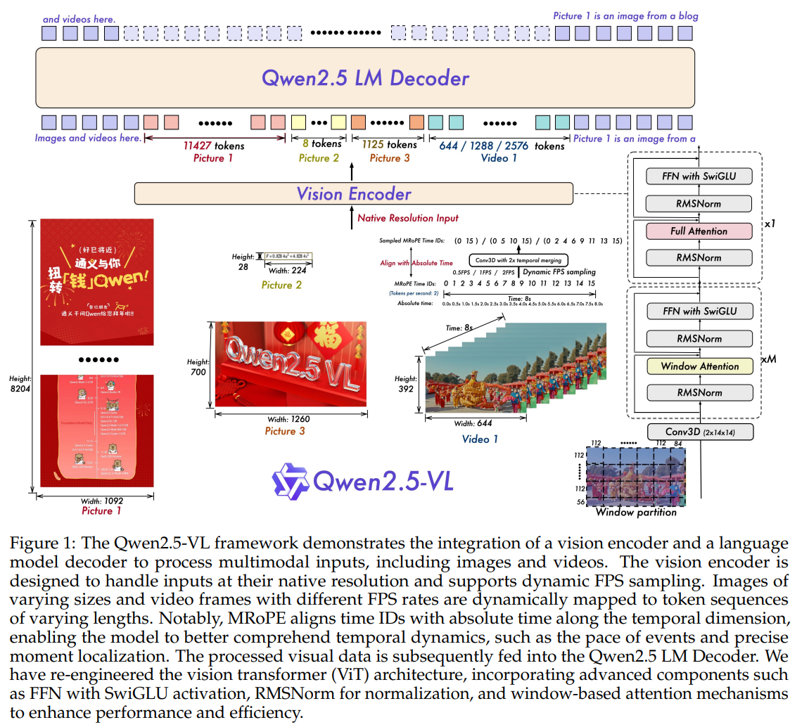

# Qwen2.5-VL Technical Report

**Paper:** https://arxiv.org/abs/2502.13923  
**Code:** https://github.com/QwenLM/Qwen2.5-VL  
**Hugging Face:** [https://huggingface.co/Qwen](https://huggingface.co/Qwen)  
**Year:** 2025

## Summary

This paper addresses the challenge of advancing large vision-language models (LVLMs) beyond general competency to achieve exceptional performance in fine-grained visual tasks. Current models often face limitations in detailed visual perception, computational efficiency, contextual understanding, and handling inputs of varying lengths. These bottlenecks hinder their application as robust, real-world agents.

To tackle this, the authors introduce **Qwen2.5-VL**, a state-of-the-art vision-language model that significantly enhances multimodal understanding and interaction. The core of this work lies in several key innovations: a redesigned Vision Transformer (ViT) that uses **window attention** for efficiency, the introduction of **dynamic resolution processing** for images, and **dynamic frame rate (FPS) sampling** for videos. This allows the model to natively process inputs of various sizes and durations without distortion. Furthermore, the model's temporal understanding is upgraded with **Multimodal Rotary Position Embedding (MRoPE) aligned to absolute time**, enabling precise event localization in videos lasting up to several hours.

### Architecture

The proposed method is built on an architecture consisting of a vision encoder, a large language model (LLM), and a merger module. The vision encoder is a newly designed **Vision Transformer (ViT)** trained from scratch, while the language model is initialized from the powerful **Qwen2.5 LLM**. This architecture is designed for efficiency and high performance, incorporating windowed attention to linearly scale computation with input size and a multi-layer perceptron (MLP) to compress visual features before they are fed to the LLM. The model is available in three sizes (3B, 7B, and 72B parameters) to cater to different computational environments.

## Datasets Used

Qwen2.5-VL was trained on a massive and meticulously curated dataset to build its advanced capabilities. The pre-training corpus was expanded from 1.2 trillion to approximately **4.1 trillion tokens**, featuring a diverse mix of data types to foster deep multimodal understanding. The training process was divided into three stages, with data composition and sequence length adjusted to progressively enhance the model's abilities.

| Pre-Training Stage | Data Types | Total Tokens | Sequence Length | Trained Components |
| --- | --- | --- | --- | --- |
| Stage 1: Visual Pre-Training | Image Caption, Visual Knowledge, OCR | 1.5T | 8,192 | ViT only |
| Stage 2: Multimodal Pre-Training | Interleaved Data, VQA, Video, Grounding, Agent Data, Pure Text | 2.0T | 8,192 | ViT & LLM |
| Stage 3: Long-Context Pre-Training | Long Video, Long Agent, Long Document | 0.6T | 32,768 | ViT & LLM |

Post-training involved Supervised Fine-Tuning (SFT) on approximately 2 million high-quality, instruction-following samples and Direct Preference Optimization (DPO) to align the model's behavior with human preferences.

## Experiments and Results

The authors conducted extensive experiments, evaluating Qwen2.5-VL against leading proprietary models like GPT-4o and Claude 3.5 Sonnet, as well as top open-source models. The results show that **Qwen2.5-VL-72B** achieves state-of-the-art performance across a wide range of benchmarks, particularly excelling in document understanding, math, and general visual question answering.

Key results are summarized below, highlighting the performance of the flagship 72B model:

| Benchmark | Task Type | GPT-4o | Previous Open-Source SOTA | **Qwen2.5-VL-72B** |
| :--- | :--- | :--- | :--- | :--- |
| **MMMU-val** | College-level Problems | 69.1 | 70.1 | **70.2** |
| **MathVista-mini** | Math | 63.8 | 72.3 | **74.8** |
| **MATH-Vision-full** | Math | 30.4 | 32.2 | **38.1** |
| **MMBench-EN-test** | General VQA | 83.4 | 88.3 | **88.6** |
| **MMStar** | General VQA | 64.7 | 69.5 | **70.8** |
| **MM-MT-Bench**| Multi-modal Chat | 7.72 | - | **7.6** |

Another important finding was that the smaller Qwen2.5-VL models (7B and 3B) also outperform comparable competitor models, offering powerful capabilities for resource-constrained environments.

## Model Components

The **Qwen2.5-VL** architecture integrates a vision encoder and a large language model to process complex multimodal inputs.

*   **Vision Encoder**: A redesigned Vision Transformer (ViT) that processes images and videos at their **native resolution**. It uses **windowed attention** in most layers to efficiently handle inputs of varying sizes, reducing computational complexity from quadratic to linear. It also employs 2D Rotary Positional Embedding (RoPE) to capture spatial relationships.
*   **Large Language Model (LLM)**: The model uses **Qwen2.5** as its language processing backbone. It features an innovative **Multimodal Rotary Position Embedding Aligned to Absolute Time (MRoPE)**. Unlike previous methods, this allows the model to understand the absolute timing of events in a video by aligning position IDs with actual timestamps, improving temporal reasoning.
*   **Vision-Language Merger**: A simple but effective two-layer MLP that compresses the long sequences of visual features extracted by the ViT. This reduces the computational load on the LLM and allows for dynamic handling of feature sequences of different lengths.

The diagram below illustrates how these components work together. Multimodal inputs (images or videos) are processed by the Vision Encoder, which dynamically handles resolution and frame rates. The resulting visual features are passed to the Qwen2.5 LLM, which integrates them with textual information to generate a coherent response. The entire system is refined through multi-stage pre-training and post-training alignment (SFT and DPO).

*   **Input**: Image or Video + Text Prompt.
*   **Processing**:
    *   The **Vision Encoder** converts visual input into feature representations, preserving native resolution and temporal information.
    *   The **Vision-Language Merger** compresses these features.
    *   The **Qwen2.5 LLM** receives the visual features and text prompt to perform reasoning and generate a response.
*   **Output**: Textual response (e.g., analysis, answers, document parsing).

## Implications and Future Work

The implications of this research are significant, as Qwen2.5-VL pushes the performance of open-source models to a level competitive with, and in some cases superior to, top-tier closed-source systems. Its advanced capabilities in understanding documents, parsing charts, localizing objects, and comprehending long videos open up new possibilities for real-world applications. The model's functionality as a visual agent, capable of operating computers and mobile devices, marks a substantial step toward creating more autonomous and useful AI systems.

The paper's conclusion highlights the model's proficiency in fine-grained perception and reasoning. By open-sourcing the models, the authors aim to foster continued innovation in the multimodal AI community. While the paper showcases major advancements, it also notes that achieving perfect alignment between visual and textual modalities during complex reasoning remains an ongoing challenge, suggesting a key direction for future research.

### BibTeX Citation

```bibtex
@misc{qwen_team2025qwen2.5-vl,
      title={Qwen2.5-VL Technical Report}, 
      author={Qwen Team, Alibaba Group},
      year={2025},
      eprint={2502.13923},
      archivePrefix={arXiv},
      primaryClass={cs.CV}
}
```
