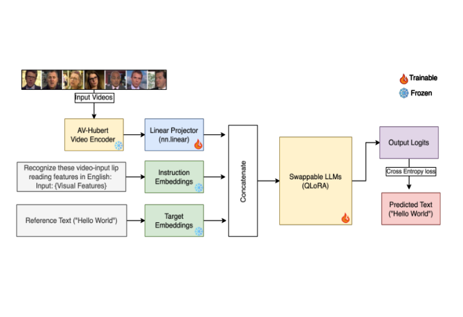

# VALLR: Visual ASR Language Model for Lip Reading

**Paper:** [https://arxiv.org/pdf/2503.21408](https://arxiv.org/pdf/2503.21408)  
**Code:** Code not yet released (The paper states it will be released after the review process)  
**Year:** 2025

## Summary

This paper addresses the significant challenge of **Visual Automatic Speech Recognition (V-ASR)**, or lip reading. Current approaches often struggle with the inherent ambiguity of lip movements, where different sounds (phonemes) can look identical (visemes), and the effects of coarticulation, where adjacent sounds blur together. These challenges lead to high error rates in models that try to predict words directly from visual data.

To tackle this, the authors introduce a novel method named **VALLR (Visual ASR Language Model for Lip Reading)**. The core idea behind this approach is a two-stage, phoneme-centric framework. First, a vision model analyzes the video of lip movements and predicts a sequence of phonemes, which are the basic units of sound. This simplifies the complex task of direct word recognition. Second, this phoneme sequence is fed into a fine-tuned Large Language Model (LLM), which uses its advanced understanding of language to reconstruct a coherent sentence. This method is distinct from previous work because it separates the visual recognition task from the linguistic reconstruction task, making the model highly data-efficient and more interpretable.

### Architecture


The proposed method is built upon a **two-stage architecture combining a Vision Transformer (ViT) and an LLM**. This architecture is designed to first interpret the visual data into a basic linguistic format (phonemes) and then use a powerful language model to form complete sentences.

The model is composed of four main components:
*   **Visual Feature Extractor**: A Vision Transformer (ViT) processes the video frames to capture spatio-temporal features of the speaker's lip movements.
*   **Adapter Network**: A series of 1D convolutional and pooling layers that reduce the length of the feature sequence from the ViT, preparing it for phoneme prediction.
*   **CTC Head**: A linear layer that takes the adapted features and predicts a sequence of phonemes. It uses a Connectionist Temporal Classification (CTC) loss, which allows the model to learn mappings without needing exact time alignment for each phoneme.
*   **Phoneme-to-Sentence LLM**: An LLM (such as Llama 3.2) is fine-tuned to translate the predicted phoneme sequence into a coherent sentence. This leverages the LLM's ability to handle grammatical structures and correct minor errors in the phoneme prediction.

## Datasets Used

| Dataset Name | Task(s) | Data Size (Hours) | Other Details |
| :--- | :--- | :--- | :--- |
| LRS3 | Visual-to-Phoneme Model Training | 30 hours | The model was trained only on the 'train-val' set, not the larger 'pre-train' set used by many other methods. |
| LRS2 | Visual-to-Phoneme Model Training | 28 hours | The model was trained only on the 28-hour training partition. |
| WikiText | Phoneme-to-Sentence LLM Fine-tuning | N/A | Text sentences were converted into phoneme sequences using the CMU dictionary to create pairs for training the LLM. |

## Experiments and Results

The authors evaluate their approach on the LRS2 and LRS3 benchmarks, using the Word Error Rate (WER) as the primary metric. The results show that VALLR achieves state-of-the-art performance, significantly outperforming previous methods while using a fraction of the training data.

The key results on the LRS3 dataset are shown below, comparing VALLR to other self-supervised methods.

| Method | Labeled Data (hrs) | Unlabeled Data (hrs) | WER (%) |
| :--- | :--- | :--- | :--- |
| RAVEn | 433 | 1759 | 23.1% |
| USR | 433 | 1,326 | 21.5% |
| **Ours (VALLR)** | **30** | **-** | **18.7%** |

On the LRS2 dataset, VALLR achieves a WER of **20.8%** using only 28 hours of labeled data, which is highly competitive with other state-of-the-art models that require extensive pre-training and more data. An important finding from ablation studies was that the two-stage approach (WER of 18.7%) is significantly better than a direct end-to-end prediction from video to sentence (WER of 25.6%), highlighting the benefit of the intermediate phoneme representation.

## Model Components

The **VALLR** architecture is a pipeline that processes video inputs and produces text outputs through distinct, specialized stages.

-   **Video-to-Phoneme Stage**: This is the first half of the model, responsible for visual interpretation.
    -   **Vision Transformer (ViT) Encoder**: Takes cropped 224x224 pixel video frames of the speaker's mouth as input and encodes them into feature representations.
    -   **Temporal Downsampling**: An adapter network of convolutional layers reduces the sequence length of the features to make it manageable for the next step.
    -   **CTC Head**: This component predicts the final sequence of phonemes from the visual features. It is trained to identify the most likely phonemes without strict temporal alignment.

-   **Phoneme-to-Sentence Stage**: This second half of the model handles linguistic reconstruction.
    -   **Fine-Tuned LLM**: The sequence of phonemes predicted by the first stage serves as a prompt to a fine-tuned LLM. The LLM, trained on phoneme-to-text data, reconstructs the final sentence, correcting errors and filling in gaps using its contextual knowledge.

The diagram below illustrates the flow of information through the model.

*   **Input**: Video of a speaker's face.
*   **Processing**:
    1.  The face is detected and cropped to the mouth region.
    2.  The video frames are passed to the **Vision Transformer** to extract visual features.
    3.  An **Adapter Network** downsamples the features.
    4.  The **CTC Head** predicts a sequence of phonemes.
    5.  The phoneme sequence is input into the **Fine-Tuned LLM**.
*   **Output**: The final predicted text sentence.

## Implications and Future Work

The implications of this research are substantial. By providing a more effective and data-efficient method for lip reading, this work opens up new possibilities for **assistive technologies for the Deaf and hard-of-hearing communities** and for applications in noisy or privacy-sensitive environments. It establishes a strong baseline for combining specialized vision models with the powerful contextual reasoning of LLMs.

Despite the model's success, it is still limited by the visual ambiguity of certain phonemes (like /s/ vs. /z/) and can be confused by words that are phonetically similar (homophones). The authors suggest that future work could focus on refining the phoneme-to-word generation process, perhaps by incorporating deeper linguistic context modeling or exploring speaker-adaptive fine-tuning to better handle subtle visual differences between speakers.

## BibTeX Citation
```bibtex
@misc{thomas2025vallr,
      title={VALLR: Visual ASR Language Model for Lip Reading}, 
      author={Marshall Thomas and Edward Fish and Richard Bowden},
      year={2025},
      eprint={2503.21408},
      archivePrefix={arXiv},
      primaryClass={cs.CV}
}
```
